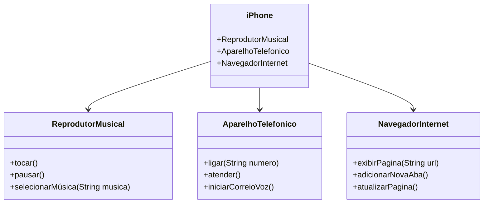

# Diagrama Uml de classes
**Luis Carlos Macêdo Moreira | June 12, 2024**

```mermaid
classDiagram
    class ReprodutorMusical {
        +tocar()
+pausar()
+selecionarMúsica(String musica)
    }

    class AparelhoTelefonico {
        +ligar(String numero)
+atender()
+iniciarCorreioVoz()
    }

    class NavegadorInternet {
         +exibirPagina(String url)
+adicionarNovaAba()
+atualizarPagina()
    }

    class iPhone {
        +ReprodutorMusical
        +AparelhoTelefonico
        +NavegadorInternet
    }

    iPhone --> ReprodutorMusical
    iPhone --> AparelhoTelefonico
    iPhone --> NavegadorInternet
```
